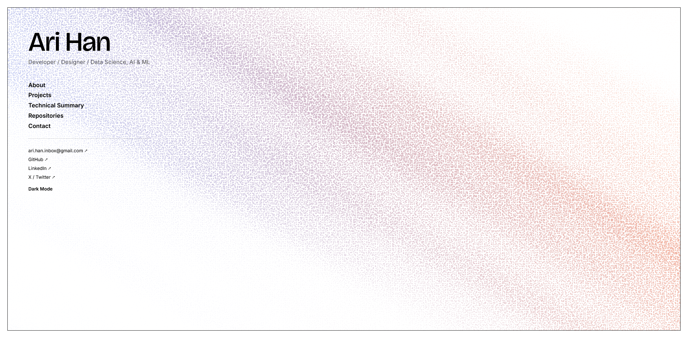
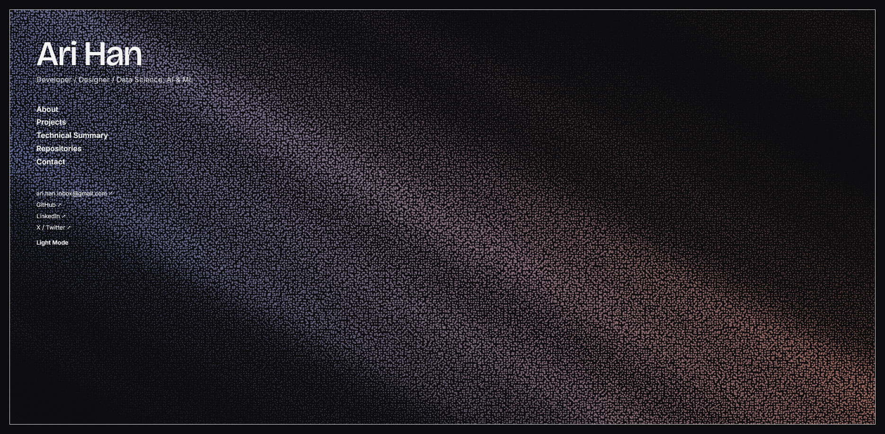

# Portfolio 

## Live Site 
[View Portfolio on Github Pages](https://han-ari.github.io/Vite-Portfolio/)

My personal portfolio built to showcase web development, design, and data science/AI/ML work all in one place. This site is a continuous scrolling page with the option to manually select sections.
About, Projects, Technical Summary, Repositories, and Contact sit neatly in a hero column that's fixed on the left while an animated wave background plays behind everything. 
Content fades in as you scroll and the nav underline always tracks which section you're currently viewing. 

## Screenshots
| Light Mode | Dark Mode |
|---|---|
|  |  |

## Key Features 
 
- **Live GitHub Repositories** - fetched directly from the GitHub API on page load
  (no hardcoded data), with a loading state and a real retry button if the fetch fails.
- **Filterable, Searchable Projects grid** - category filter tabs (Web / Design /
  Data Science, AI & ML) combine with live text search across project titles and
  descriptions; each project shows a title, description, and color-coded tech tags.
- **Dark Mode Toggle** - persists across visits via `localStorage`, and respects the
  visitor's OS-level color scheme on first visit. Applied before first paint (a small
  inline script in `index.html`) so there's no flash of the wrong theme on load.
- **Accessible by Default** - WCAG AA color contrast throughout, expanded touch
  targets on every interactive link/button, `aria-live` regions on dynamic content
  (repo loading state, contact form status), and decorative elements hidden from
  screen readers.
- **Fully Responsive** - tested across mobile, tablet, and desktop breakpoints, with
  the two-column hero/content layout collapsing to a stacked single column on small
  screens.

## Tech Stack
 
- **Build tool:** Vite (npm-based, ES Modules)
- **Frontend:** Vanilla HTML, CSS, and JavaScript - no frameworks
- **Data:** GitHub REST API (live repository data)
- **Fonts:** Bricolage Grotesque (display) and Inter (body), via Google Fonts
- **Deployment:** GitHub Pages, published from a `gh-pages` branch via the
  [`gh-pages`](https://www.npmjs.com/package/gh-pages) npm package

## Module Structure
JavaScript is split into four ES Modules, each with a single responsibility:
 
- **`src/api.js`** - `fetchRepos()` and `repoCard()`. All GitHub API interaction and
  the repo card template live here.
- **`src/projects.js`** - `initProjectFilters()`. Owns the Projects section's category
  filter tabs and live search, combined together against the same result set.
- **`src/site.js`** - everything else that isn't Projects or Repositories: the canvas
  wave animation, scroll-driven section reveal and nav highlighting, hero/nav vertical
  alignment syncing, the contact form, and the dark mode toggle. Each piece is its own
  exported `init` function.
- **`src/main.js`**-— wiring only. Imports the pieces above and calls them on
  `DOMContentLoaded`; contains no rendering or fetch logic of its own beyond using the
  imported `repoCard()` template to build the repo grid.
